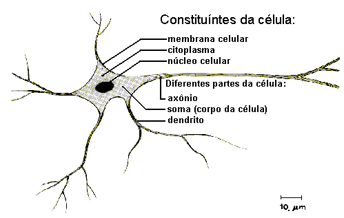
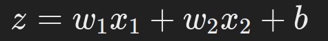
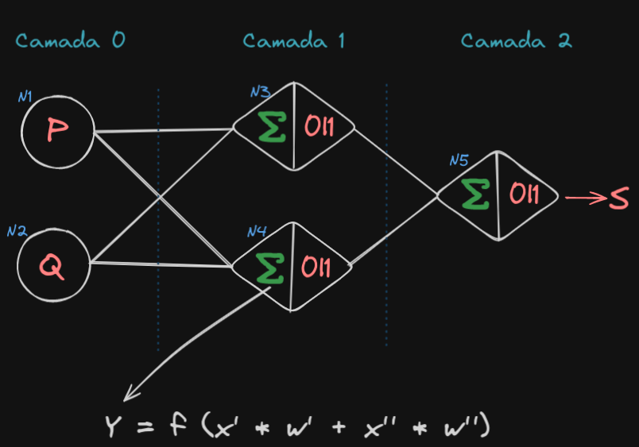
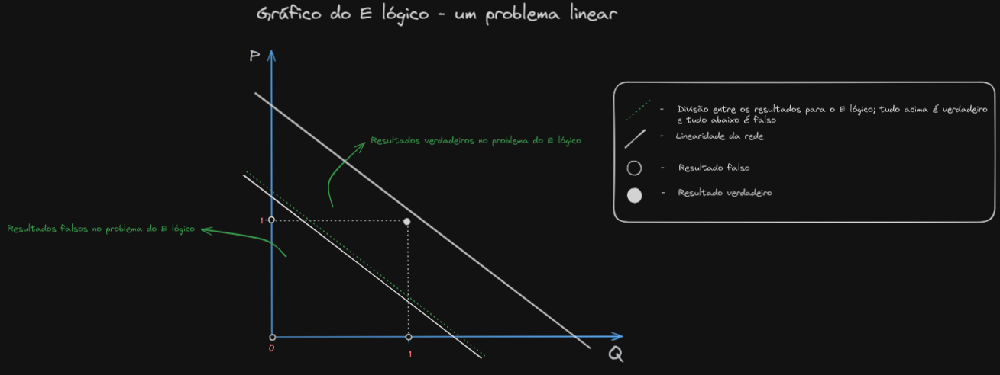
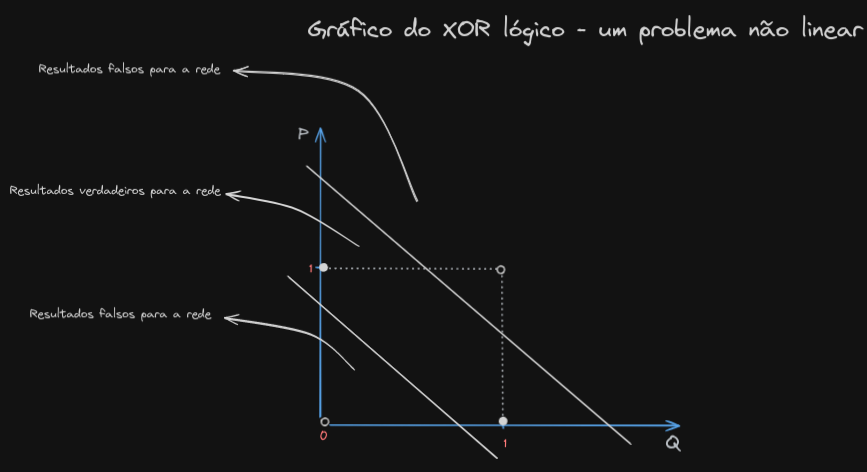

# "Hello, World!" em redes neurais

Esse projeto é uma implementação básica de uma rede neural bi-linear "from scratch" feita em C/C++ que é capaz de aprender proposições lógicas. Esse projeto serve como exemplo educacional e ponto de partida no estudo de aprendizado de máquina.

## Introdução

O objetivo é apresentar os conceitos básicos de redes neurais, como inicialização de pesos, cálculo de aptidão e um processo evolutivo básico, todos implementados do zero. A rede emprega listas aninhadas para simular uma população de redes neurais e as desenvolve usando uma abordagem de algoritmo genético.

O projeto é feito focando nos padrões de C, além disso, aplicamos o conceito de de listas aninhadas para estruturar a rede. Vale ressaltar que as abordagens adotadas não são as melhores em termos de desempenho/facilidade de construção, pois o projeto foca nos conceitos de redes neurais e não na prática da construção delas, por isso quase não são usadas funções de bibliotecas externas no código (apenas quando seria necessário implementar algo que fugisse do escopo de redes neurais). Esse modelo, apesar de bi-linear, é limitado e precisaria de adoção de viés para se adequar à problemas lógicos mais sofisticados. 

Além disso, o projeto é feito de tal forma que conhecimento em lógica e matemática não são necessários em nível avançado, optando-se por não fazer uso de álgebra linear ou matrizes, por exemplo.

## Entendendo a arquitetura da rede

### Estrutura de Dados: Listas Aninhadas

Para implementar a rede neural, utilizamos uma estrutura de dados baseada em listas aninhadas. Essa abordagem permite organizar os neurônios e suas conexões de maneira flexível e escalável. Vamos explorar como essa estrutura de listas aninhadas é utilizada no projeto.

#### Definição das Estruturas

Primeiramente, definimos as estruturas de dados para os neurônios e sinapses. Cada neurônio é representado por um nó em uma lista, e cada sinapse (conexão) é representada por outra lista que conecta os neurônios.

```c
// Estrutura de um neurônio
typedef struct Neuronio {
    float soma;               // Soma ponderada das sinapses de entrada
    int peso;                 // Estado do neurônio (0 ou 1)
    struct Neuronio *prox;    // Ponteiro para o próximo neurônio na lista
} TNeuronio;

// Estrutura de uma sinapse
typedef struct Sinapse {
    float peso;               // Peso da sinapse
    struct Sinapse *prox;     // Ponteiro para a próxima sinapse na lista
} TSinapse;

// Estrutura para a lista de sinapses
typedef struct ListaSinapses {
    TSinapse *inicio;         // Ponteiro para o início da lista de sinapses
} TListaSinapses;

// Estrutura para a lista de neurônios
typedef struct ListaNeuronios {
    TNeuronio *inicio;        // Ponteiro para o início da lista de neurônios
    float sinapseThreshold;   // Threshold para a função de ativação
} TListaNeuronios;
```

#### Inicialização das Listas

A inicialização das listas de neurônios e sinapses é feita de forma que cada neurônio e cada sinapse sejam alocados dinamicamente. Cada lista começa vazia e os neurônios e sinapses são adicionados conforme necessário.

```c
// Inicializa uma lista de neurônios vazia
TListaNeuronios* inicializaListaNeuronios(float threshold) {
    TListaNeuronios *L = (TListaNeuronios*)malloc(sizeof(TListaNeuronios));
    L->inicio = NULL;
    L->sinapseThreshold = threshold;
    return L;
}

// Inicializa uma lista de sinapses vazia
TListaSinapses* inicializaListaSinapses() {
    TListaSinapses *L = (TListaSinapses*)malloc(sizeof(TListaSinapses));
    L->inicio = NULL;
    return L;
}
```

#### Adição de Neurônios e Sinapses

Para adicionar neurônios e sinapses às suas respectivas listas, criamos funções específicas. Essas funções garantem que os novos elementos sejam corretamente conectados às listas existentes.

```c
// Adiciona um neurônio à lista
void adicionaNeuronio(TListaNeuronios *L, int peso) {
    TNeuronio *novo = (TNeuronio*)malloc(sizeof(TNeuronio));
    novo->peso = peso;
    novo->soma = 0;
    novo->prox = L->inicio;
    L->inicio = novo;
}

// Adiciona uma sinapse à lista
void adicionaSinapse(TListaSinapses *L, float peso) {
    TSinapse *novo = (TSinapse*)malloc(sizeof(TSinapse));
    novo->peso = peso;
    novo->prox = L->inicio;
    L->inicio = novo;
}
```

#### Utilização das Listas na Rede Neural

Com as listas de neurônios e sinapses inicializadas e preenchidas, podemos utilizá-las para construir a rede neural e realizar cálculos. A estrutura das listas permite percorrer facilmente os neurônios e sinapses, aplicando os cálculos necessários para o treinamento e a avaliação da rede.

```c
// Exemplo de utilização das listas para cálculo na rede neural
void calculaSaida(TListaNeuronios *L, TListaSinapses *S) {
    TNeuronio *n3 = L->inicio->prox->prox; // Neurônio 3
    TNeuronio *n4 = n3->prox;              // Neurônio 4
    TSinapse *sinAtual = S->inicio;
    
    // Calculando sinapses da camada 1
    n3->soma = (L->inicio->peso * sinAtual->peso) + (L->inicio->prox->peso * sinAtual->prox->peso);
    n4->soma = (L->inicio->peso * sinAtual->prox->prox->peso) + (L->inicio->prox->peso * sinAtual->prox->prox->prox->peso);

    // Aplicando a função de ativação (threshold)
    n3->peso = (n3->soma >= L->sinapseThreshold) ? 1 : 0;
    n4->peso = (n4->soma >= L->sinapseThreshold) ? 1 : 0;

    // Calculando sinapses da camada 2
    TNeuronio *n5 = n4->prox; // Neurônio 5
    float peso35 = sinAtual->prox->prox->prox->prox->peso;
    float peso45 = sinAtual->prox->prox->prox->prox->prox->peso;

    // Somatório para o neurônio da camada 2
    n5->soma = (n3->peso * peso35) + (n4->peso * peso45);

    // Aplicando a função de ativação (threshold) para o neurônio da camada 2
    n5->peso = (n5->soma >= L->sinapseThreshold) ? 1 : 0;
}
```

### Neurônios

#### Neurônios Biológicos



Um neurônio biológico é uma célula nervosa especializada no processamento e transmissão de informações através de sinais elétricos e químicos. Ele é composto por várias partes principais:

1. **Dendritos**: Ramificações que recebem sinais de outros neurônios.
2. **Corpo Celular (Soma)**: Contém o núcleo da célula e é responsável pela integração dos sinais recebidos.
3. **Axônio**: Um longo filamento que transmite sinais elétricos do corpo celular para outras células.
4. **Terminais Axonais**: Ramificações na extremidade do axônio que liberam neurotransmissores para comunicar com outros neurônios.

Cada uma dessas partes desempenha um papel crucial na transmissão de informações. Os sinais recebidos pelos dendritos são integrados no corpo celular e, se a soma dos sinais ultrapassar um certo limiar, o neurônio gera um potencial de ação que viaja pelo axônio até os terminais axonais, onde neurotransmissores são liberados para transmitir o sinal a outros neurônios.

#### Réplicas Artificiais no Código

No código do projeto, simulamos alguns aspectos dos neurônios biológicos, especialmente os conceitos de soma ponderada, função de ativação e conexões entre neurônios. Vamos explorar como essas partes biológicas são replicadas artificialmente.

1. **Dendritos e Soma**: Correspondem aos inputs e à soma ponderada no código.
    - **Biológico**: Dendritos recebem sinais de outros neurônios, que são somados no corpo celular.
    - **Artificial**: As entradas de um neurônio (dendritos) são simuladas pelas variáveis de peso e soma ponderada. A soma ponderada é calculada como uma combinação linear das entradas, ponderada pelos pesos das conexões.

    ```c
    // Calculando sinapses da camada 1
    n3->soma = (neuAtual->peso * peso13) + (neuAtual->prox->peso * peso23);
    n4->soma = (neuAtual->peso * peso14) + (neuAtual->prox->peso * peso24);
    ```

2. **Axônio**: Representa a saída do neurônio.
    - **Biológico**: O axônio transmite o potencial de ação do corpo celular até os terminais axonais.
    - **Artificial**: A saída do neurônio após a função de ativação representa o axônio transmitindo o sinal.

    ```c
    // Aplicando a função de ativação (threshold)
    n3->peso = (n3->soma >= L->sinapseThreshold) ? 1 : 0;
    n4->peso = (n4->soma >= L->sinapseThreshold) ? 1 : 0;
    ```

3. **Função de Ativação**: Equivalente ao disparo do potencial de ação.
    - **Biológico**: Se a soma dos sinais recebidos pelos dendritos ultrapassa um certo limiar, o neurônio gera um potencial de ação.
    - **Artificial**: A função de ativação (threshold) decide se o neurônio se "ativa" (output = 1) ou não (output = 0), baseado na soma ponderada das entradas.

    ```c
    n3->peso = (n3->soma >= L->sinapseThreshold) ? 1 : 0;
    n4->peso = (n4->soma >= L->sinapseThreshold) ? 1 : 0;
    ```

A rede é composta por 5 neurônios divididos em 3 camadas. Cada neurônio guarda um valor binário que representa seu estado de estímulo (um neurônio com valor 1 está estimulado, enquanto que com valor 0 está desestimulado), de forma que a calibração e os ajustes de peso se dá nas conexões entre os neurônios. Além disso, os neurônios tem tanto input (por ondem recebem uma sinapse que pode, ou não, estimulá-los) e um output (por onde, caso estimulado, libera uma sinapse). 

Do lado do input, um neurônio pode receber de 0 à n sinapses, de forma que o estado do neurônio (se ele guarda 0 ou 1) é dado a partir de uma condicional: caso o somatório de todas as sinapses recebidas no input, cada uma multiplicada pelo peso da sua respectiva conexão com o neurônio que está recebendo a sinapse, mais um valor de viés, seja maior que a métrica `Sinapse Threshold`, consideramos que a sinapse teve peso o suficiente para estimular o neurônio, então seu estado passa a ser 1; caso isso não seja satisfeito, o neurônio permanece inativo (não estimulado), logo, com valor 0. Em código, isso é implementado da seguinte forma:

```c
// Calculando sinapses da camada 1
n3->soma = (neuAtual->peso * peso13) + (neuAtual->prox->peso * peso23);
n4->soma = (neuAtual->peso * peso14) + (neuAtual->prox->peso * peso24);

// Aplicando a função de ativação (threshold)
n3->peso = (n3->soma >= L->sinapseThreshold) ? 1 : 0;
n4->peso = (n4->soma >= L->sinapseThreshold) ? 1 : 0;

// Calculando sinapses da camada 2
TNeuronio *n5 = n4->prox; // Neurônio 5
float peso35 = sinAtual->peso;
sinAtual = sinAtual->prox;
float peso45 = sinAtual->peso;

// Somatório para o neurônio da camada 2
n5->soma = (n3->peso * peso35) + (n4->peso * peso45);

// Aplicando a função de ativação (threshold) para o neurônio da camada 2
n5->peso = (n5->soma >= L->sinapseThreshold) ? 1 : 0;
```

Neste trecho, a soma ponderada é calculada para cada neurônio e depois a função de ativação é aplicada. A variável `n3->soma` representa o input do neurônio antes da aplicação da função de ativação.

Matematicamente, podemos expressar o somatório do input de um neurônio da seguinte forma (num exemplo de um neurônio recebendo duas sinapses no seu input, assim como acontece na rede neural do projeto):




### Camadas

Camadas são conjuntos de neurônios. A rede neural é composta por três camadas: uma camada de entrada, uma camada oculta e uma camada de saída. Cada camada é responsável por processar os inputs recebidos e transmitir os resultados para a próxima camada. A camada de entrada recebe os inputs iniciais, que são processados pelos neurônios da camada oculta. A camada oculta aplica as funções de ativação e transmite os resultados para a camada de saída, que gera a saída final da rede.

#### Camada de Entrada

A camada de entrada é composta por dois neurônios que recebem os inputs iniciais. Esses neurônios transmitem suas saídas para os neurônios da camada oculta.

#### Camada Oculta

A camada oculta contém dois neurônios que recebem os outputs dos neurônios da camada de entrada. Eles aplicam a função de ativação aos somatórios ponderados das sinapses recebidas e transmitem os resultados para a camada de saída.

#### Camada de Saída

A camada de saída consiste em um único neurônio que recebe os outputs dos neurônios da camada oculta. Esse neurônio aplica a função de ativação ao somatório ponderado das sinapses recebidas e gera a saída final da rede.



## Entendendo o processo evolutivo

O processo evolutivo no código é baseado em conceitos da evolução natural. Assim como na natureza, onde a evolução é guiada pela variação genética, seleção natural, herança e adaptação, o processo evolutivo artificial implementado no projeto busca otimizar uma população de redes neurais ao longo de várias gerações.

Do lado da evolução natural, as características dos organismos são moldadas através de gerações por meio de mutações e recombinações genéticas. Essas variações são então filtradas pela seleção natural, onde os indivíduos mais aptos têm maior chance de sobreviver e se reproduzir. A herança genética garante que essas características vantajosas sejam passadas para a próxima geração, resultando em uma população cada vez mais adaptada ao ambiente.

No processo evolutivo artificial, cada rede neural na população inicial é criada com pesos aleatórios. Essas redes neurais são avaliadas com base em um critério de aptidão, que determina quão bem elas desempenham a tarefa desejada (por exemplo, resolver uma proposição lógica). As redes neurais com maior aptidão são selecionadas para a próxima geração. Novas redes são criadas combinando características das melhores redes da geração anterior e introduzindo variações através de mutações, imitando o processo de recombinação genética e mutação na natureza. Esse ciclo de avaliação, seleção, recombinação e mutação é repetido por várias gerações, com o objetivo de melhorar gradualmente a aptidão das redes neurais.

A evolução natural é um processo biológico pelo qual as populações de organismos mudam ao longo do tempo através de variações genéticas e seleção natural. As principais componentes desse processo incluem:

1. **Variação Genética**: Mutação e recombinação introduzem variação no pool genético.
2. **Seleção Natural**: Organismos com características vantajosas têm maior probabilidade de sobreviver e se reproduzir, passando essas características para a próxima geração.
3. **Herança**: As características vantajosas são transmitidas aos descendentes.
4. **Adaptação**: Ao longo do tempo, a população se torna mais adaptada ao seu ambiente.

### Evolução Artificial no Código

No código do projeto, o processo evolutivo é simulado para desenvolver uma rede neural capaz de aprender proposições lógicas. Este processo inclui:

1. **Inicialização da População**: Criação de uma população inicial de redes neurais com pesos aleatórios.
2. **Cálculo da Aptidão (Fitness)**: Avaliação da performance de cada rede neural com base em um critério de aptidão.
3. **Seleção**: Escolha das melhores redes neurais com base na sua aptidão.
4. **Recombinação e Mutação**: Criação de uma nova geração de redes neurais combinando os melhores indivíduos e introduzindo variação através de mutações.
5. **Iteração**: Repetição do processo por várias gerações até atingir um critério de parada (por exemplo, uma aptidão satisfatória).

### Detalhamento do Processo Evolutivo no Código

1. **Inicialização da População**
   - Uma lista de redes neurais é criada, cada uma com pesos aleatórios.
   ```c
   void inicializaPopulacao(Populacao *pop, int tamanho) {
       for (int i = 0; i < tamanho; i++) {
           pop->individuos[i] = criaRedeNeuralAleatoria();
       }
   }
   ```

2. **Cálculo da Aptidão (Fitness)**
   - Cada rede neural é avaliada com base em como ela executa uma tarefa específica (por exemplo, resolver uma proposição lógica).
   ```c
    void avaliacaoIndividuos(TLista *L)
    {
        L->individuoAtual = L->populacao;

        while (L->individuoAtual != NULL)
        {
            L->individuoAtual->erros = 0;

            // Montando as sinapses para esse indivíduo
            TSinapse *sinAtual = L->pesos;
            for (int i = 0; sinAtual != NULL; i++)
            {
            sinAtual->peso = L->individuoAtual->genes[i];
            sinAtual = sinAtual->prox;
            }
            sinAtual = L->pesos; // Reiniciando o ponteiro de sinapses

            // Acessando as lições para avaliar o indivíduo
            TLicao *licAtual = L->licoes;
            while (licAtual != NULL)
            {

            // Montando camada 0
            TNeuronio *neuAtual = L->neuronios;
            neuAtual->peso = licAtual->p;       // Neurônio 1
            neuAtual->prox->peso = licAtual->q; // Neurônio 2

            // Calculando sinapses da camada 1
            TNeuronio *n3 = neuAtual->prox->prox; // Neurônio 3
            TNeuronio *n4 = n3->prox;             // Neurônio 4

            // Pesos das sinapses para a camada 1
            sinAtual = L->pesos;
            float peso13 = sinAtual->peso;
            sinAtual = sinAtual->prox;
            float peso14 = sinAtual->peso;
            sinAtual = sinAtual->prox;
            float peso23 = sinAtual->peso;
            sinAtual = sinAtual->prox;
            float peso24 = sinAtual->peso;
            sinAtual = sinAtual->prox;

            // Somatório para os neurônios da camada 1
            n3->soma = (neuAtual->peso * peso13) + (neuAtual->prox->peso * peso23);
            n4->soma = (neuAtual->peso * peso14) + (neuAtual->prox->peso * peso24);

            // Aplicando a função de ativação (threshold)
            n3->peso = (n3->soma >= L->sinapseThreshold) ? 1 : 0;
            n4->peso = (n4->soma >= L->sinapseThreshold) ? 1 : 0;

            // Calculando sinapses da camada 2
            TNeuronio *n5 = n4->prox; // Neurônio 5
            float peso35 = sinAtual->peso;
            sinAtual = sinAtual->prox;
            float peso45 = sinAtual->peso;

            // Somatório para o neurônio da camada 2
            n5->soma = (n3->peso * peso35) + (n4->peso * peso45);

            // Aplicando a função de ativação (threshold) para o neurônio da camada 2
            n5->peso = (n5->soma >= L->sinapseThreshold) ? 1 : 0;

            // Verificando o resultado da saída
            if (n5->peso != licAtual->resultadoEsperado)
            {
                L->individuoAtual->erros++;
            }

            licAtual = licAtual->prox;
            }

            L->individuoAtual = L->individuoAtual->prox;
        }
    }
    ```

3. **Seleção**
   - Redes neurais com melhor aptidão são selecionadas para a próxima geração.
   ```c
    void poda(TLista *L)
    {
        /* Elimina os indivíduos menos aptos (que estão no
            fim da Lista) até que a população volte ao seu
            Limite estabelecido na configuração inicial
            (L->Qtd_Populacao). */

        TIndividuo *atual = L->populacao;

        for (int i = 1; i < L->Qtd_Populacao; i++)
            atual = atual->prox; // Obtendo a referência para o último indivíduo da população

        // Liberando a memória a partir do indivíduo imediatamente depois da
        // referência da referência
        liberarMemListaPopulacao(atual->prox);
        atual->prox = NULL; // Indicando o novo fim da lista para o último indivíduo
        // da população
        L->totalIndividuos = L->Qtd_Populacao;
    }
   ```

4. **Recombinação e Mutação**
   - Novas redes neurais são criadas combinando pesos das melhores redes e introduzindo mutações.
   ```c
    void promoveMutacoes(TLista *L)
    {
        /* Altera o código genético de um número específico
            de indivíduos (= L->Qtd_Mutacoes_por_vez). */

        TIndividuo *atual = L->populacao, *inicioCrias;
        int randomI,
            *iMutacoes = (int *)malloc(sizeof(int) * L->Qtd_Mutacoes_por_vez),
            iMutacao;
        for (int i = 0; i < L->Qtd_Mutacoes_por_vez; i++)
            iMutacoes[i] = -1; // Populando a área de memeória alocada para não termos
        // probelmas de comparação

        // gerar o número correto de números de indivíduos para alterar, sendo n
        // aleatórios diferentes entre 0 e L->totalIndividuos
        srand((unsigned)time(NULL));

        for (int c = 0; c < L->Qtd_Mutacoes_por_vez; c++)
        {

            do
            {
            // Gerando um número aleatório para algum indivíduo da populaçao; nesse
            // caso, apenas filhos sofrem mutação, isso é apenas uma questão de
            // escolha para ser parecer mais com uma ocasião real
            randomI = randomInRange(L->Qtd_Populacao, L->totalIndividuos); // Gerando um número entre a
            // primeira e última cria
            } while (isInVector(randomI, iMutacoes, L->Qtd_Mutacoes_por_vez));

            iMutacoes[c] = randomI;
        }

        for (int i = 0; i < L->Qtd_Mutacoes_por_vez; i++)
        {

            atual = L->populacao;

            for (int j = 0; j < iMutacoes[i]; j++)
            {
            atual = atual->prox;
            }

            iMutacao = randomInRange(0, (MAX_Pesos - 1));
            randomInRange(0, 1) ? atual->genes[iMutacao] = atual->genes[iMutacao] + (L->learningRate) : atual->genes[iMutacao] = atual->genes[iMutacao] - (L->learningRate);

            if (atual->genes[randomI] < 0)
            {
            atual->genes[randomI] = 0;
            }
            else if (atual->genes[randomI] > 1)
            {
            atual->genes[randomI] = 1;
            }

            atual->erros = -1;
        }

        free(iMutacoes);
    }

   ```

5. **Iteração**
   - O processo é repetido por várias gerações num treinamento.
   ```c
    void treinamento(TLista *L)
    {
        printf("\n\n\t\t=====| INICIADO TREINAMENTO |=====\n\n");
        fprintf(L->fp, "\n\n\tINICIO DO TREINAMENTO: ");
        // ponteiro para a struct que armazena data e hora:
        struct tm *data_hora_atual;
        // variável do tipo time_t para armazenar o tempo em segundos.
        time_t segundos;
        // Obetendo o tempo em segundos.
        time(&segundos);
        // Para converter de segundos para o tempo local
        // utilizamos a função localtime().
        data_hora_atual = localtime(&segundos);

        fprintf(L->fp, "Dia: %d", data_hora_atual->tm_mday);
        fprintf(L->fp, "   Mes: %d", ((data_hora_atual->tm_mon) + 1));
        fprintf(L->fp, "   Ano: %d\n\n", (data_hora_atual->tm_year + 1900));

        fprintf(L->fp, "Dia da Semana: %d.\n", data_hora_atual->tm_wday);

        fprintf(L->fp, "%d", data_hora_atual->tm_hour);
        fprintf(L->fp, ":%d", data_hora_atual->tm_min);
        fprintf(L->fp, ":%d.\n\n", data_hora_atual->tm_sec);

        int i, file_flag = 1;
        for (i = 0; i < L->Total_geracoes; i++)
        {
            cruzamento(L);

            if ((i % L->Qtd_Geracoes_para_Mutacoes) == 0)
            {
            promoveMutacoes(L);
            } // if

            avaliacaoIndividuos(L);

            ordenamentoIndividuos(L);

            poda(L);

            if (!totalErros(L) && file_flag)
            {
            fprintf(L->fp, "\n\n\t=====| PRIMEIRA GERAÇÃO SEM ERROS: %d |=====\n\n", i + 1);
            file_flag = 0;
            }

        } // for
        //printf("\n%d\n", i);
        // Exibindo resultados do terinamento
        printf("\n\n\t\t=====| TERMINADO TREINAMENTO |=====\n\n");
        exibirPopulacao(*L);

        // Gravando resultados do terinamento
        fprintf(L->fp, "\n\n\tFIM DO TREINAMENTO: ");
        // Obetendo informações de data e hora do fim do treinamento
        // Obetendo o tempo em segundos.
        time(&segundos);
        // Para converter de segundos para o tempo local
        // utilizamos a função localtime().
        data_hora_atual = localtime(&segundos);

        fprintf(L->fp, "Dia: %d", data_hora_atual->tm_mday);
        fprintf(L->fp, "   Mes: %d", ((data_hora_atual->tm_mon) + 1));
        fprintf(L->fp, "   Ano: %d\n\n", (data_hora_atual->tm_year + 1900));

        fprintf(L->fp, "Dia da Semana: %d.\n", data_hora_atual->tm_wday);

        fprintf(L->fp, "%d", data_hora_atual->tm_hour);
        fprintf(L->fp, ":%d", data_hora_atual->tm_min);
        fprintf(L->fp, ":%d.\n\n", data_hora_atual->tm_sec);

        // Gravando resultados da populacao
        fprintf(L->fp, "\n\n\tPOPULAÇÃO AO FIM DO PROCESSO EVOLUTIVO: ");
        gravarPopulacao(*L);
    }
   ```

## Entendendo a natureza da linearidade da rede

Em matemática e aprendizado de máquina, problemas podem ser classificados como lineares ou não lineares com base na relação entre as variáveis envolvidas.

#### Problemas Lineares

Um problema é considerado linear quando a relação entre as variáveis pode ser expressa como uma combinação linear.

Uma característica importante das funções lineares é que elas formam uma linha reta quando plotadas em um gráfico. Redes neurais que usam apenas combinações lineares de entradas são limitadas em termos do tipo de problemas que podem resolver, pois elas não conseguem capturar a complexidade de relações não lineares entre as variáveis.

#### Problemas Não Lineares

Problemas não lineares, por outro lado, envolvem relações onde a mudança na saída não é proporcional à mudança nas entradas. Essas relações podem ser expressas de formas mais complexas, como polinômios de ordem superior, exponenciais, logaritmos, etc.

### Redes Neurais Bi-Lineares

A rede neural bi-linear implementada no projeto é capaz de resolver problemas que envolvem relações lineares e algumas formas de combinações não lineares simples, devido à sua arquitetura.

#### Processamento Bi-Linear

A capacidade da rede de resolver problemas bi-lineares é baseada no fato de que as camadas intermediárias podem combinar entradas de forma que o neurônio da camada final receba uma combinação de entradas ponderadas de forma não trivial.

A rede combina as entradas de forma linear em cada camada, mas a combinação de várias camadas permite uma representação bi-linear das entradas, onde a saída é influenciada por combinações de produtos das entradas e seus pesos. Isso permite que a rede capture algumas relações não lineares simples, especialmente aquelas que podem ser decompostas em múltiplas operações lineares sequenciais.

#### Como a rede lida com problemas lineares e Não Lineares?

Se você leu o texto que precede este tópico, analisar o gráfico será o suficiente para que entenda como a rede lida com diferentes problemas.

##### Rede lidando com o problema do `E` lógico:


##### Rede lidando com o problema do `XOR` (ou exclusivo) lógico:


## Como usar esse projeto?

Para rodar o projeto usando o Makefile fornecido, siga os passos abaixo:

### Passo a Passo para Rodar o Projeto

1. **Instalação do Pré-requisito:**
   - Certifique-se de ter o compilador `g++` instalado em seu sistema. O Makefile está configurado para usar o `g++` como compilador.

2. **Estrutura do Projeto:**
   - O projeto deve seguir a estrutura de diretórios definida no Makefile. Certifique-se de que os diretórios `src`, `output/obj`, e `output/bin` estejam presentes.

3. **Comandos do Makefile:**
   - O Makefile define várias regras que você pode usar:
     - `make`: Compila o projeto no modo especificado por `MODE` (default é `release`).
     - `make clean`: Remove todos os arquivos compilados e binários gerados.
     - `make debug`: Compila o projeto no modo de depuração e inicia o debugger `gdb`.
     - `make run`: Limpa o projeto, compila no modo `release` e executa o executável gerado.

4. **Modo de Compilação:**
   - Você pode escolher entre os modos `release` e `debug` ao compilar:
     - **Release (`make MODE=release`)**: Otimizações de código estão habilitadas (`-O3`), ideal para executar o projeto final.
     - **Debug (`make MODE=debug`)**: Inclui informações de depuração (`-g`) e desativa otimizações (`-O0`), útil para depurar o código usando `gdb`.

5. **Execução do Projeto:**
   - Para compilar e executar o projeto, você pode simplesmente usar:
     ```bash
     make run
     ```
   - Este comando irá limpar qualquer compilação anterior, compilar o projeto no modo `release` e executar o binário gerado.

6. **Depuração:**
   - Se precisar depurar o código, você pode usar:
     ```bash
     make debug
     ```
   - Este comando limpará o projeto, compilará no modo `debug`, e iniciará o debugger `gdb` para o executável gerado.
